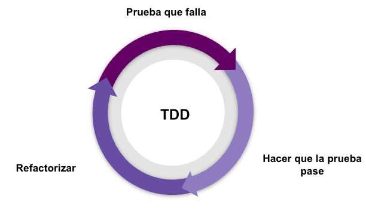
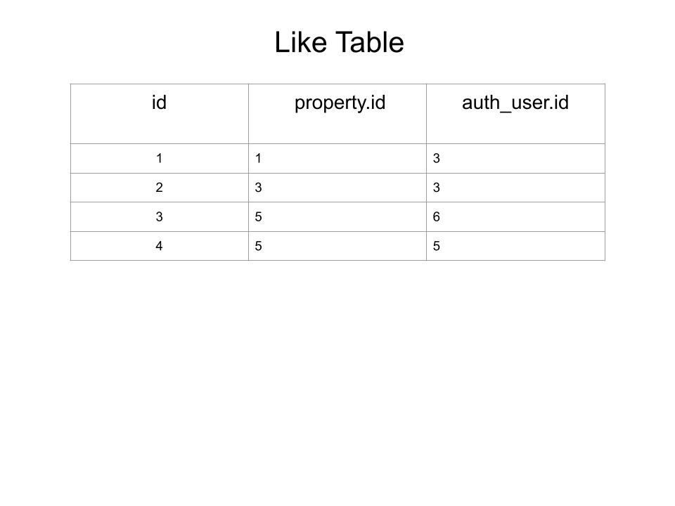

# tuhabiAPI

Prueba técnica tuhabi.mx

Demo: [API](http://ec2-52-90-21-171.compute-1.amazonaws.com:8000/)

Docs: [API](http://ec2-52-90-21-171.compute-1.amazonaws.com:8000/docs) 

Redoc: [API](http://ec2-52-90-21-171.compute-1.amazonaws.com:8000/redoc)

## Introducción

Habi desea tener una herramienta en la que sus usuarios puedan consultar los 
inmuebles disponibles para la venta. 

En esta herramienta los usuarios deben ser capaces de ver tanto los inmuebles 
vendidos como los disponibles. Con el objetivo de hacer más fácil la búsqueda, 
se espera que los usuarios puedan aplicar diferentes filtros a la búsqueda.
Adicionalmente, se espera que los usuarios puedan darle “me gusta” a los 
inmuebles con el fin de tener un ranking interno de los inmuebles más 
llamativos.

## Historias de usuario

### Servicio de consulta

- Los usuarios pueden consultar los inmuebles con los estados: “pre_venta”, 
  “en_venta” y “vendido” (los inmuebles con estados distintos nunca deben 
  ser visibles por el usuario).
  
- Los usuarios pueden filtrar estos inmuebles por: Año de construcción,
  Ciudad, Estado.
  
- Los usuarios pueden aplicar varios filtros en la misma consulta.
  
- Los usuarios pueden ver la siguiente información del inmueble: Dirección, 
  Ciudad, Estado, Precio de venta y Descripción.

### Servicio "Me gusta"

- Los usuarios pueden darle me gusta a un inmueble en específico y esto 
  debe quedar registrado en la base de datos.
  
- Los “Me gusta” son de usuarios registrados, y debe quedar registrado en 
  la base de datos el histórico de “me gusta” de cada usuario y a cuáles 
  inmuebles.
  
## Metodología de desarrollo

### Servicio de consulta

Para implementar el servicio de consulta emplearé
el framework FastAPI que me permitirá exponer el endpoint para que 
los usuarios consulten los inmuebles de acuerdo a los filtros aplicados.

La base de datos proporcionada para la prueba es MySQL y por ello 
emplearé el conector MySQL Connector/Python (el cual cumple con la 
especificación [Python Database API Specification v2.0 PEP 249](
https://peps.python.org/pep-0249/))
y que permite que los programas en Python accedan a bases de datos 
MySQL.

La metodología de diseño propuesta es TDD (Test Driven Development) que 
consiste en el siguiente flujo:
  
* S escribe la prueba, se ejecuta y falla.
* Se escribe el código suficiente para que la 
    prueba pase el test.
* Se refactoriza el código para mejorarlo.
  
  

### Servicio de "Me gusta"

Este requerimiento es conceptual debido a que no existe el modelo en la 
base de datos para implementarlo. La propuesta es crear un diagrama 
entidad - relación empleando la herramienta de Google 
Drawings y SQL para extender el modelo.

## Stack tecnológico y herramientas

- Python 3.8.9
- FastAPI 0.75.0
- MySQL 5.7.12 (MySQL Community Server (GPL))
- MySQL Connector/Python  8.0.28
- Google Drawings

## Configuración del proyecto (servicio consulta)

### Instalación
Sugerencia: Utilizar ``` Virtualenv ```

Virtualenv es una herramienta para crear ambientes aislados de python
y tiene una gran utilidad para manejar diferentes proyectos
y sus dependencias de forma organizada.

[Guía de instalación de virtualenv](https://virtualenv.pypa.io/)

Instalar dependencias de requirements.txt usando pip
```
pip install -r requirements.txt
```

Configurar variables de entorno 
creando un archivo llamado .env 
en la raíz del proyecto y una vez guardado 
tus archivos deben verse así:
```
|database/
|docs/
|tests/
|.gitignore
|README.md
|config.py
|filters.py
|main.py
|queries.py
|requirements.txt
|serializers.py
|.env    <================
```

En este archivo ingresaremos las siguientes variables:
```
## DB CONFIGURATION ##
DB_HOST=host_de_la_base
DB_PORT=puerto_de_la_base
DB_NAME=nombre_de_la_base
DB_USER=nombre_de_usuario
DB_PASSWORD=contraseña

## GENERAL ###
## Estados de propiedades permitidos ##
ALLOWED_STATUSES="'pre_venta', 'en_venta', 'vendido'"
```

Ahora podemos correr el servidor de desarrollo uvicorn
con el siguiente comando:
```
uvicorn main:app --reload
```

La consola mostrará los siguientes mensajes y podemos
entrar consumir el servicio en http://127.0.0.1:8000:
```
INFO:     Uvicorn running on http://127.0.0.1:8000 (Press CTRL+C to quit)
INFO:     Started reloader process [17619] using statreload
INFO:     Started server process [17621]
INFO:     Waiting for application startup.
INFO:     Application startup complete.
```

### Tests
Para generar los tests es necesario ingresar el siguiente
comando en la terminal:

```
pytest
```

El resultado será el siguiente:

```
plugins: anyio-3.5.0
collected 7 items                                                              

tests/test_properties.py .......                                         [100%]

============================== 7 passed in 4.79s ===============================
```
## Documentación
FastAPI nos brinda dos endpoints de documentación de bastante
utilidad y son los siguientes:
```
 - ReDoc:  [http://localhost:8000/redoc](http://localhost:8000/redoc)
 - Docs: [http://localhost:8000/docs](http://localhost:8000/docs)
```

A continuación se muestra el archivo ```properties_params.json```
el cual específica que datos se espera que lleguen de front con los
filtros solicitados por los usuarios.

Link al archivo: [docs/properties_params](
https://github.com/Lawlet2/tuhabi_test/blob/development/docs/properties_params.json
)
```
{
  "url": "/properties",
  "params": {
    "city": "bogota",
    "year": 2000
  },
  "url_with_params": "/properties?year=2000&city=bogota"
}
```

## Propuesta (servicio "Me gusta")
Analizando las tablas auth_user y property podemos concluir
que una forma de crear la tabla de "Me gusta" es registrando
el id de propiedad y el id de usuario para tener una relación
de muchos usuarios a muchas propiedades.

A continuación se muestra la tabla propuesta:



y el código SQL para generarla:

```
CREATE TABLE [habi_db].[like] (
    [Id]      INT IDENTITY(1,1) NOT NULL,
    property_id INT(11) NOT NULL,
    auth_user_id INT(11) NOT NULL,

    FOREIGN KEY(property_id) REFERENCES property(id),
    FOREIGN KEY(auth_user_id) REFERENCES auth_user(id),
    UNIQUE (property_id, auth_user_id)
);
```


